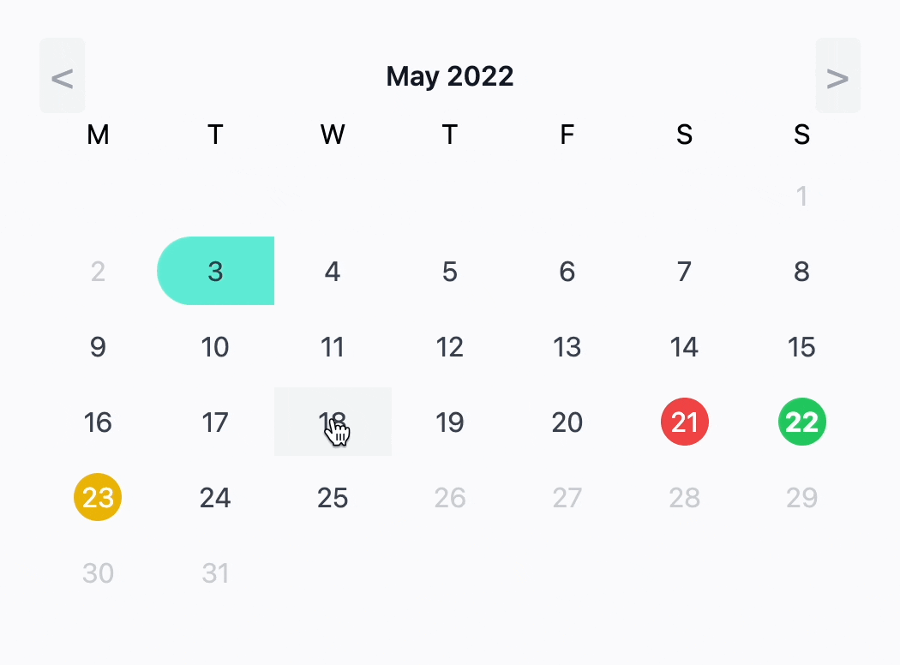
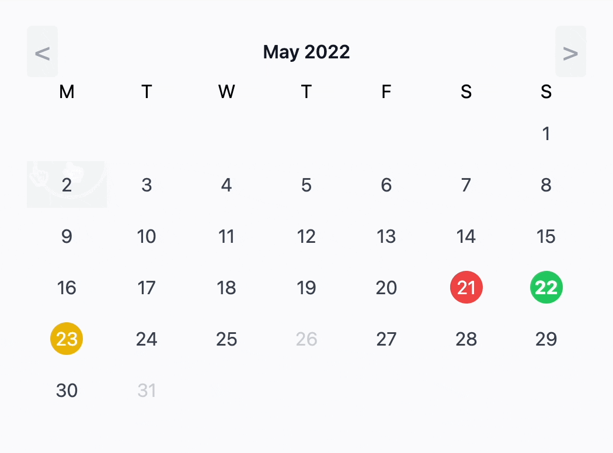

# LivewireDatepicker

Livewire datepicker is a standalone livewire component that gives you a calendar, datepicker and date-range picker.

This is not yet a stable release.

| Range picker                                | Date picker                               |
|---------------------------------------------|-------------------------------------------|
|  |  |

## Installation

Via Composer

``` bash
$ composer require haringsrob/livewire-datepicker
```

## Usage

This package uses tailwindcss.

You need to add `./vendor/haringsrob/livewire-datepicker/resources/**/*.blade.php` to the purge list of your
tailwind.config.json

To use this, create a new livewire component and extend the `DatePickerComponent` class:

```php
use Haringsrob\LivewireDatepicker\Http\Livewire\DatePickerComponent;

class TestCalendar extends DatePickerComponent
{
    // Pick any of the 3 options.
    public string $type = self::TYPE_RANGE_PICKER;
    public string $type = self::TYPE_DATEPICKER;
    public string $type = self::TYPE_DISPLAY_ONLY;
}
```

Then depending on the needs, add availability data:

```php
public function getAvailabilityData(): Collection
{
    return collect([
        new DatePickerDayData(Carbon::yesterday(), classes: 'bg-red-500 text-white'),
        new DatePickerDayData(Carbon::tomorrow(), classes: 'bg-yellow-500 text-white'),
        new DatePickerDayData(Carbon::today(), classes: 'bg-green-500 text-white'),
        new DatePickerDayData(date: Carbon::now()->setDay(31), disabled: true, cannotPickOver: true),
        new DatePickerDayData(date: Carbon::now()->setDay(26), disabled: true, cannotPickOver: true),
    ]);
}
```

And finally emit your events to other components (if needed) (example):

```php
    /**
     * This method is called whenever the date range or a new date is set.
     */
    public function onDatesSet(): void
    {
        $this->emit('rangeSet', ['from' => $this->startRange->format('Y-m-d'), 'till' => $this->endRange->format('Y-m-d')]);
    }

    /**
     * This method is called whenever the date range or a new date is unset.
     */
    public function onDatesUnSet(): void
    {
        $this->emit('rangeUnset');
    }
```

More documentation will follow but you can always have a look at the component to see what options are available.

## Change log

Please see the [changelog](changelog.md) for more information on what has changed recently.

## Testing

``` bash
$ composer test
```

## Contributing

Please see [contributing.md](contributing.md) for details and a todolist.

## Security

If you discover any security related issues, please email haringsrob@gmail.com instead of using the issue tracker.

## License

MIT. Please see the [license file](license.md) for more information.
